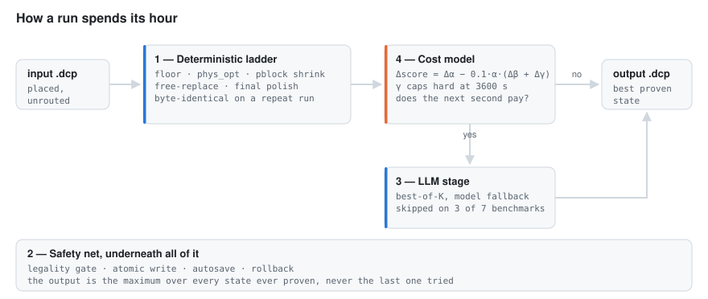
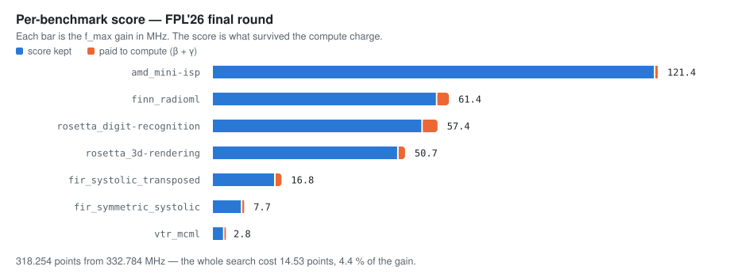

# FPL'26 FPGA Design Optimization Contest — team MEEMAR's submission

[](https://github.com/randomuzbek/meemar-fpl26-optimizer/actions/workflows/ci.yml)
[](https://scorecard.dev/viewer/?uri=github.com/randomuzbek/meemar-fpl26-optimizer)
[](LICENSE)
[](RESULTS.md)
[](RESULTS.md)
[](https://hits.sh/github.com/randomuzbek/meemar-fpl26-optimizer/)
[](https://github.com/randomuzbek/meemar-fpl26-optimizer/stargazers)

A post-placement FPGA timing optimizer that **prices its own compute in contest points** and
stops when the next second stops paying for itself. MEEMAR is the team the entry was submitted
under, not a product name: the optimizer is the single file in `submission/`, and it runs as the
contest harness's `dcp_optimizer.py`.

It was built for the [FPL'26 FPGA Design Optimization Contest](https://xilinx.github.io/fpl26_optimization_contest/),
where it scored 318.254 across seven benchmarks with zero disqualifications and placed in the top
five — one person, no institutional compute. The scorecard is [below](#what-it-scored); the
reasoning that produced it comes first.

<picture>
  <source media="(prefers-color-scheme: dark)" srcset="docs/img/pipeline-dark.svg">
  
</picture>

---

## The idea

The contest does not score frequency. It scores

```
per-benchmark score = max(0, α − 0.1·α·(β + γ))
```

where α is the f_max improvement in MHz, β is dollars spent on LLM calls and γ is wall-clock
hours. Two consequences drive the entire design of this optimizer.

**A dollar costs exactly what an hour costs, and both scale with α.** Searching harder is not
free — it is charged at `0.1·α` per unit. On a design where α is 103, a 442-second run has
already burned 1.25 points before any gain is counted; on a design where α is 12, an hour costs
almost nothing. So the correct amount of search is *different on every design*, and it depends on
how well that design is already doing. This inverts the obvious intuition: a second is worth most
on the designs that are already fast and high-α, not on the slowest one.

**γ has a hard 3600-second cap, and it is a cliff rather than a slope.** A truncated run does not
merely pay the γ term; it loses every megahertz it had not yet banked. Seconds spent near the cap
can cost α outright.

This optimizer therefore computes its own break-even before spending
(`_gamma_fill_breakeven_mhz`), banks every improvement to disk the moment it is proven
(`_autosave_best`), and exits early on designs a deterministic pass has already brought close to
their ceiling. The reasoning is written up in **[docs/scoring-model.md](docs/scoring-model.md)**.

## How it works

Four layers, all inside `submission/dcp_optimizer.py`.

**1. A deterministic prepass ladder** runs before any language model is consulted, and does most
of the work. `_seed_baseline_floor` immediately banks a legal output so that no later failure can
produce a zero. Then `_deterministic_phys_opt_prepass`, `_deterministic_pblock_shrink` (a
device-centric, clock-region-aligned, roughly 50 %-density pblock derivation — the single largest
lever), `_free_replace_rescue` and `_surgical_replace` for designs whose placement is improvable,
and `_final_polish`. Same input, same host, same thread count produces a byte-identical result.

**2. A safety net** that makes an illegal or worse-than-input result structurally impossible.
`_design_is_legal` gates every candidate, `_atomic_write_output` prevents partial writes,
`_autosave_best` keeps the best proven state, `_restore_best_for_retry` rolls back, and
`_resolve_api_key_or_deterministic` degrades to the deterministic pipeline when no API key is
present rather than crashing. The output is the maximum over everything ever proven, never the
last thing tried.

**3. An LLM layer** — best-of-K first-stage sampling (`_run_stage1_best_of_k`), an optional second
stage (`_maybe_run_stage2`), and a model fallback chain (`_model_fallback_chain`) so that a single
unavailable model cannot end a run. It is deliberately the *last* layer: on three of the seven
final benchmarks it was skipped entirely, and those three scored highest.

**4. The cost model** described above, wired into runtime decisions rather than applied in
hindsight.

Detail, with the call graph: **[docs/architecture.md](docs/architecture.md)**.

## What it scored

The submission ran on the organizers' hardware, seven benchmarks, one instance each.

| | |
|---|---|
| Total score | **318.254** |
| Benchmarks | 7 (four of them unseen before the final round) |
| Legality | **7/7 fully clean** — routed, DRC clean, hold, pulse width, simulation |
| Sum of f_max improvement | **332.784 MHz** |
| Total LLM spend | **$0.35** across all seven benchmarks ($0.3482 measured) |
| Best single design | `amd_mini-isp` 288.0 → **410.5 MHz** (+42.5 %) |

<picture>
  <source media="(prefers-color-scheme: dark)" srcset="docs/img/scorecard-dark.svg">
  
</picture>

The row worth pausing on is the spend. **Every dollar and every hour the search cost — β and γ
together — came to 14.53 points** against 332.784 MHz of gain: that is the entire price of
searching, and it is the term the design above exists to control. The largest single result in the
suite, +122.491 MHz, came out of the deterministic ladder with **zero** language-model calls, in
5.3 minutes of wall clock.

Full per-benchmark scorecard with the α/β/γ decomposition: **[RESULTS.md](RESULTS.md)**.

## What is honest about this

`_matches_v2_fingerprint` and its three siblings are benchmark fingerprints: cheap primitive-count
and port-count checks that let a known-shaped design skip straight to the treatment that worked
for it. They look like overfitting to the public suite, and it is fair to read them that way.

The counter-evidence is on the record rather than asserted. The fingerprints are a fast path, not
the mechanism — the generic decision function (`_generic_free_replace_decision`) handles anything
unrecognised, and it is what ran on the unseen designs. **Four of the seven final benchmarks had
never been seen**, all four scored positive and clean, and three of them are in the top four by
score. Generalization was also tested before the final round on designs that are not RISC-V cores
at all — systolic matrix multiply, crossbar switch fabric, DSP/BRAM macro-heavy, LUTRAM banks —
which are published here under [`benchmarks/heldout/`](benchmarks/heldout/).

Two more things worth stating plainly. One benchmark (`fir_symmetric_systolic`) hit the 3600 s γ
cap; its timeline shows the last improvement at t = 3240 s, so the truncation cost only the γ term
itself rather than a banked gain. And the determinism claim was verified against the organizers'
own numbers: two repeated benchmarks came back byte-identical to our preview runs.

## Checking it rather than believing it

Every number above is either in the repository or reproducible from it, and none of this needs an
FPGA:

```bash
md5sum submission/dcp_optimizer.py          # 64475899a43e372f4dcf441a254eec9d, the scored bytes
pip install -r requirements-dev.txt
pytest -q                                   # parsers, packager, artifact identity, the docs' own claims
```

The test suite is not decoration: it asserts the shipped md5s, that the line numbers in the docs
point at the functions they name, and that the figures above were drawn from
[RESULTS.md](RESULTS.md) rather than typed in. Rebuilding the scored archive and reproducing the
diff against AMD's upstream are two more commands, in
**[docs/reproduce.md](docs/reproduce.md)**.

| document | what it answers |
|---|---|
| [RESULTS.md](RESULTS.md) | the official per-benchmark scorecard, α/β/γ decomposed |
| [docs/architecture.md](docs/architecture.md) | the four layers, mapped to functions and line numbers |
| [docs/scoring-model.md](docs/scoring-model.md) | why a dollar costs what an hour costs |
| [docs/measurement-notes.md](docs/measurement-notes.md) | three ways this harness will lie to you if you let it |
| [docs/reproduce.md](docs/reproduce.md) | verify the hashes, rebuild the archive, run it |

## Layout

```
submission/          the scored artifact, byte-exact
  dcp_optimizer.py     md5 64475899a43e372f4dcf441a254eec9d
  SYSTEM_PROMPT.TXT    md5 4aaf8d8dceaea50c3153b24e0336b802
  requirements.txt     md5 be4dc2a597aef77d292c7d832df87554
  upstream.patch       full diff against AMD upstream a81aad5 — exactly what is ours
docs/                architecture, scoring model, measurement notes, reproduction
tools/
  pack.py              the deterministic packager that built the scored zip
  harness_timeline.py  reads contest harness logs without being lied to by them
  build_figures.py     draws the figures above from RESULTS.md, so they cannot drift from it
benchmarks/heldout/  generalization designs outside the contest suite
tests/               Vivado-free unit tests: parsers, packager, artifact identity, the docs
```

## Running it

The optimizer runs inside the contest harness, which supplies Vivado, RapidWright and the two MCP
servers. It is not a standalone tool.

```bash
git clone --recursive https://github.com/Xilinx/fpl26_optimization_contest.git
cd fpl26_optimization_contest
git checkout a81aad5
git submodule update --init --recursive   # the checkout moves the superproject, not the submodules
cp /path/to/this/repo/submission/dcp_optimizer.py .
cp /path/to/this/repo/submission/SYSTEM_PROMPT.TXT .
cp /path/to/this/repo/submission/requirements.txt .

make setup
export OPENROUTER_API_KEY=...        # optional: without it the deterministic pipeline still runs
make run_optimizer DCP=<benchmark>
```

To rebuild the submitted archive and check its md5 against the scored one, see
**[docs/reproduce.md](docs/reproduce.md)**.

## Citing

A `CITATION.cff` is included; GitHub's "Cite this repository" button will format it for you.

## License and attribution

Apache-2.0. `submission/dcp_optimizer.py` is a derivative work of a file
© 2026 Advanced Micro Devices, Inc., and retains AMD's copyright and license headers. See
[`NOTICE`](NOTICE) for the split between upstream and our modifications, and
[`submission/upstream.patch`](submission/upstream.patch) for the exact diff.

Thanks to the contest organizers at AMD — Chris Lavin and Preston Walker — for a benchmark suite
and evaluation harness that rewarded measurement over guesswork, and to Prof. Enver Çavuş for
advising the entry.
